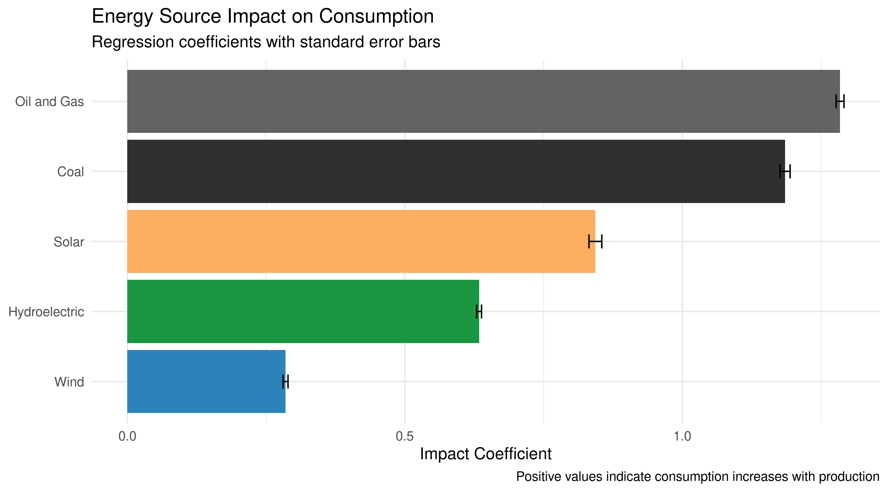

# Romania Electricity Market Analysis
**Can Renewables Power Romania's Future?**  
*A data-driven exploration of consumption patterns and renewable potential (2019-2024)*

  
*▲ Figure 1: Production breakdown by source (MW)*

## 🔍 Key Insights
- **Winter energy gap**: 12% production deficit (Dec-Feb)  
- **Solar potential**: 1.04x consumption impact per MW (highest among renewables)  
- **Coal dependence**: 1.33x consumption impact but declining  

## 📊 Results Summary

### 1. Seasonal Imbalance
  
*▲ Figure 2: Consumption vs production by season*


|Season | Avg Consumption (MW)| Avg Production (MW)|Deficit |
|:------|--------------------:|-------------------:|:-------|
|Autumn |                 6378|                6035|-5%     |
|Spring |                 6292|                6316|0%      |
|Summer |                 6289|                6050|-4%     |
|Winter |                 7108|                7065|-1%     |


### 2. Renewable Performance
  
*▲ Figure 3: 5-year renewable energy production*

- **Hydropower**: Baseline provider (mean 792 MW)  
- **Wind**: Stable but weather-dependent (max 2,811 MW)  
- **Solar**: Fastest growth (1137% increase since 2019)  

### 3. Source Impact Analysis
```r
# Top regression coefficients
Solar        1.038
Coal         1.333
Hydro        0.630
```
## Key Findings

### 4. Source Impact Analysis


```r
# Top regression coefficients
Solar        1.038
Coal         1.333  
Hydro        0.630
``` 

### 5. 📌 Appendix
Data Limitations

    ❗ Hourly data may mask micro-variations

    ❗ Excludes industrial demand surges

    ❗ No geographic granularity
    
    📚 References

    Transelectrica Annual Reports (2019-2024)

    ENTSO-E Transparency Platform

    IEA Romania Country Profile

📧 Contact

Author: Spiridon Lucian-Valentin
Institution: Economic Cybernetics, University of Bucharest
GitHub: github.com/LuciSin