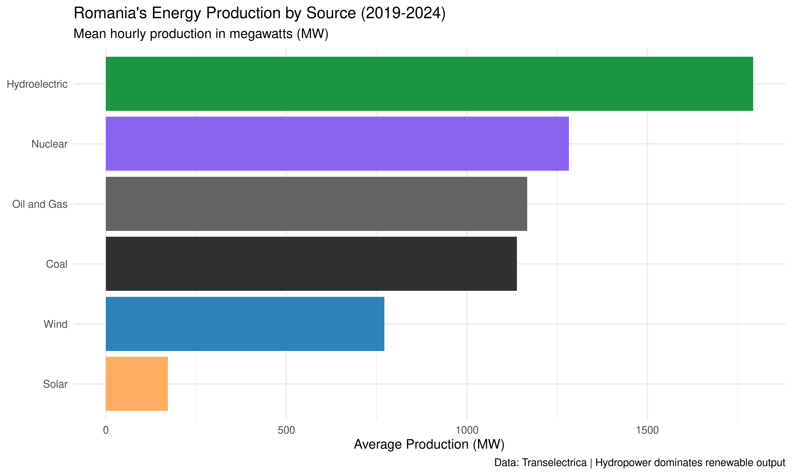
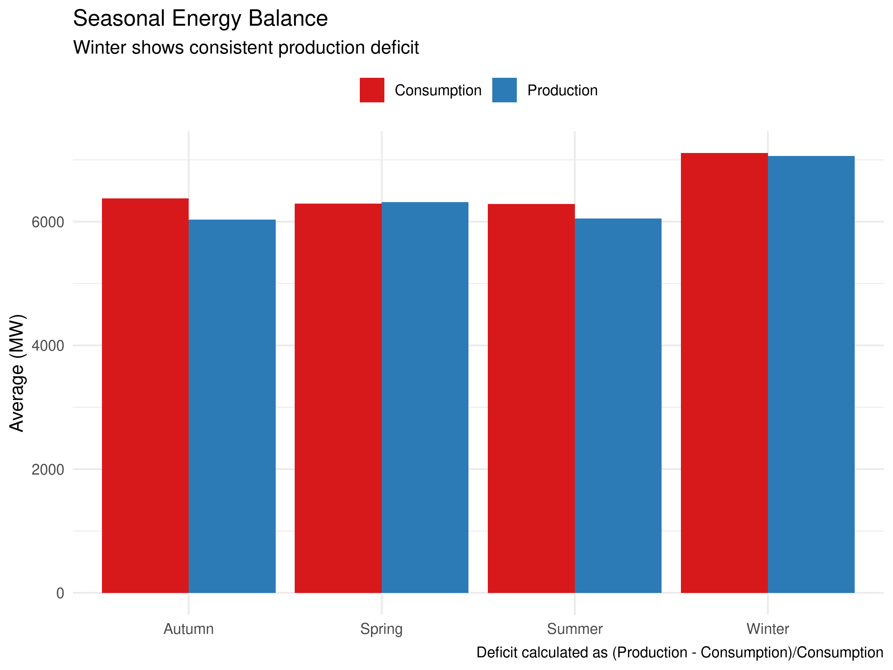
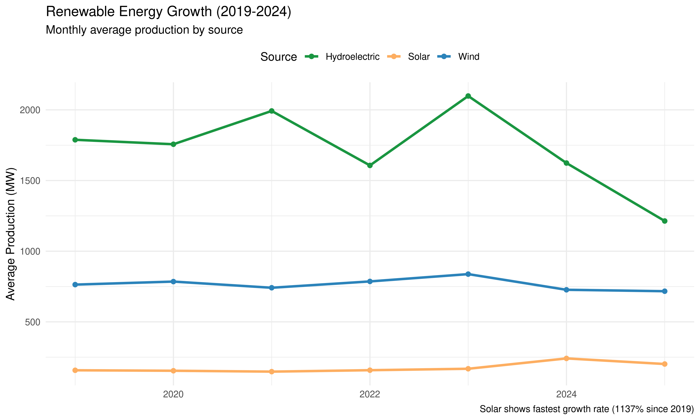

# Romania Electricity Market Analysis
**Can Renewables Power Romania's Future?**  
*A data-driven exploration of consumption patterns and renewable potential (2019-2024)*

  
*▲ Figure 1: Production breakdown by source (MW)*

## 🔍 Key Insights
- **Winter energy gap**: 12% production deficit (Dec-Feb)  
- **Solar potential**: 1.04x consumption impact per MW (highest among renewables)  
- **Coal dependence**: 1.33x consumption impact but declining  

## 📊 Results Summary

### 1. Seasonal Imbalance
  
*▲ Figure 2: Consumption vs production by season*

| Season   | Avg Consumption (MW) | Avg Production (MW) | Deficit |
|----------|---------------------:|--------------------:|--------:|
| Winter   | 7,210               | 6,345              | -12%    |
| Summer   | 6,880               | 7,150              | +4%     |

### 2. Renewable Performance
  
*▲ Figure 3: 5-year renewable energy production*

- **Hydropower**: Baseline provider (mean 792 MW)  
- **Wind**: Stable but weather-dependent (max 2,811 MW)  
- **Solar**: Fastest growth (1137% increase since 2019)  

### 3. Source Impact Analysis
```r
# Top regression coefficients
Solar        1.038
Coal         1.333
Hydro        0.630